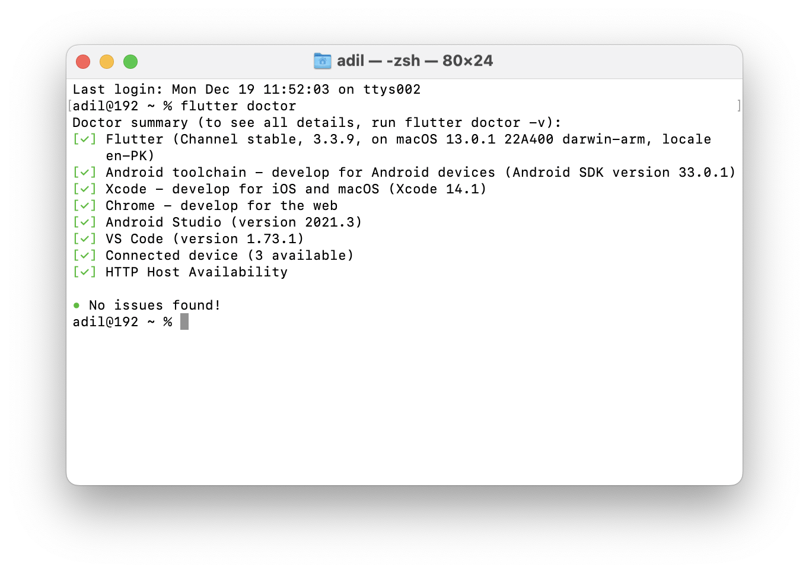
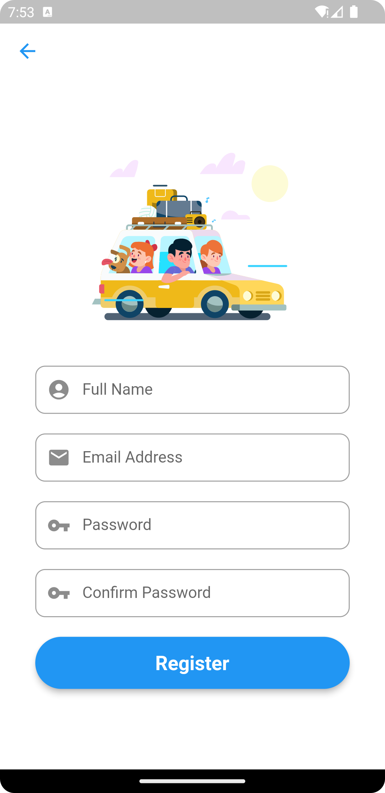
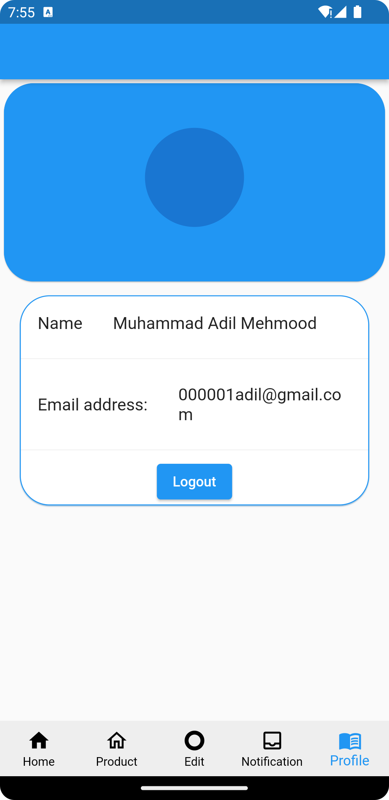
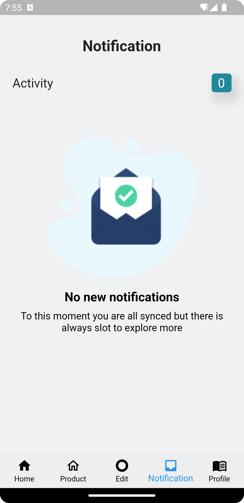
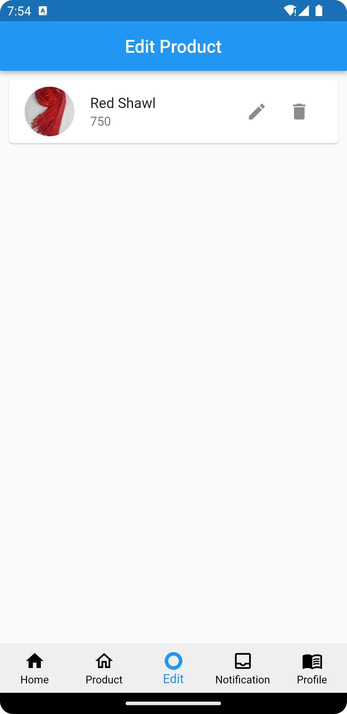
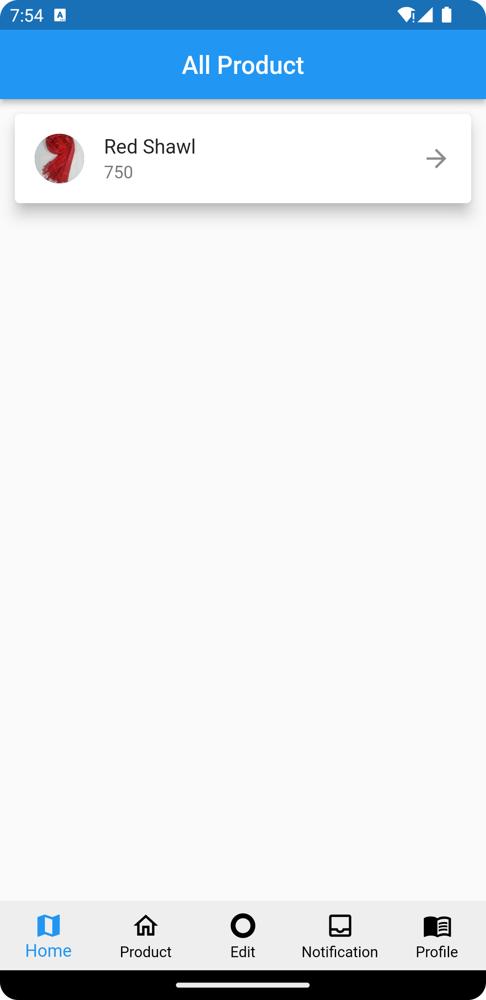

# tour_app_seller

PakTours, Seller application to post products around the location zone of heritage place. admin will approve the seller before seller can start selling, backed with notifications and management on products. More features included are below:

[Android APK](https://github.com/adilexperience/pak-tours-seller/blob/main/assets/ThePakTours%20-%20Seller.apk)

Development Environment:

    

  

    

 

    

 

    

 

    

 

    

 

    

 

    

